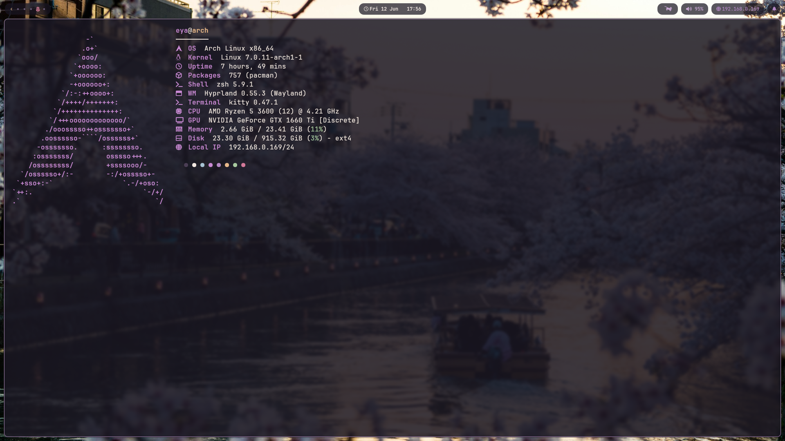
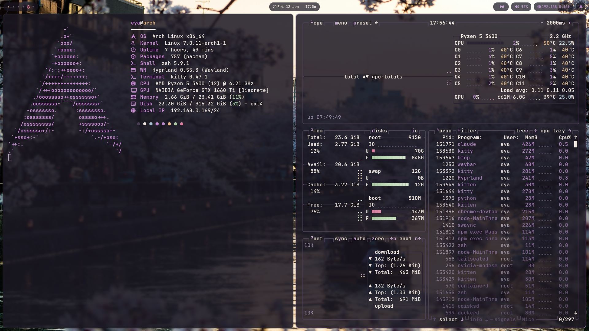
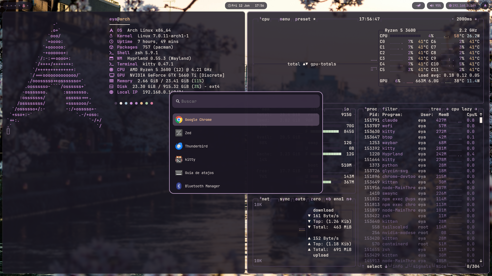

# 🌸 Dotfiles

Mi configuración de **Arch Linux + Hyprland**, con una paleta propia llamada **Sakura**.



## Paleta Sakura

| Color | Hex | Uso |
|---|---|---|
|  | `#1a1622` | Fondo |
|  | `#f0e6e0` | Texto |
|  | `#c9a8d4` | Lila (acento principal) |
|  | `#b388c4` | Lila oscuro |
|  | `#e8b88a` | Dorado |
|  | `#d47a9a` | Rosa |
|  | `#a8c9a0` | Verde |

## Componentes

| Qué | Cuál | Carpeta | Destino |
|---|---|---|---|
| Distro | Arch Linux | — | — |
| Compositor | [Hyprland](https://hyprland.org) (+ hypridle, hyprlock, hyprpaper) | [`hypr/`](hypr) | `~/.config/hypr/` |
| Barra | [Waybar](https://github.com/Alexays/Waybar) | [`waybar/`](waybar) | `~/.config/waybar/` |
| Lanzador | [Wofi](https://hg.sr.ht/~scoopta/wofi) | [`wofi/`](wofi) | `~/.config/wofi/` |
| Terminal | [kitty](https://sw.kovidgoyal.net/kitty/) | [`kitty/`](kitty) | `~/.config/kitty/` |
| Shell | zsh + Oh My Zsh + [Powerlevel10k](https://github.com/romkatv/powerlevel10k) | [`zsh/`](zsh) | `~/.zshrc`, `~/.p10k.zsh` |
| Notificaciones | [SwayNC](https://github.com/ErikReider/SwayNotificationCenter) | [`swaync/`](swaync) | `~/.config/swaync/` |
| Scratchpads | [pyprland](https://github.com/hyprland-community/pyprland) | [`pypr/`](pypr) | `~/.config/pypr/` |
| Editor | [Zed](https://zed.dev) (tema Sakura propio) | [`zed/`](zed) | `~/.config/zed/` |
| Fetch | [fastfetch](https://github.com/fastfetch-cli/fastfetch) | [`fastfetch/`](fastfetch) | `~/.config/fastfetch/` |
| Monitor | [btop](https://github.com/aristocratos/btop) (tema Sakura propio) | [`btop/`](btop) | `~/.config/btop/` |
| PDF | [Zathura](https://pwmt.org/projects/zathura/) | [`zathura/`](zathura) | `~/.config/zathura/` |
| Wallpaper | [`wallpapers/`](wallpapers) | [`wallpapers/`](wallpapers) | `~/.config/wallpapers/` |

> El módulo del gato de la barra es [runcat-text](https://github.com/bzglve/runcat-text) de **bzglve** (incluido en `waybar/modules/`).

## Capturas

### btop — tema Sakura



### Wofi



## Instalación

```bash
git clone git@github.com:hxst1/Dotfiles.git
cd Dotfiles

# Copia lo que quieras a ~/.config/, por ejemplo:
cp -r hypr kitty waybar wofi swaync fastfetch btop zathura pypr ~/.config/

# zsh va en $HOME
cp zsh/.zshrc zsh/.p10k.zsh ~/
```

> ⚠️ Las configs asumen rutas de mi máquina (`/home/eya`) en algunos scripts; revísalas antes de usarlas.

Extras que usa el `.zshrc`: `eza`, `bat`, `zoxide`, `fnm`, `fzf`, `fd`, `lazygit`, `direnv` y los plugins `zsh-autosuggestions` / `zsh-syntax-highlighting`.

## Legacy

- [`legacy/alacritty/`](legacy/alacritty) — mi antigua config de **Alacritty** (época macOS). **Desactualizada**, la conservo solo como archivo histórico. Ahora uso kitty.
